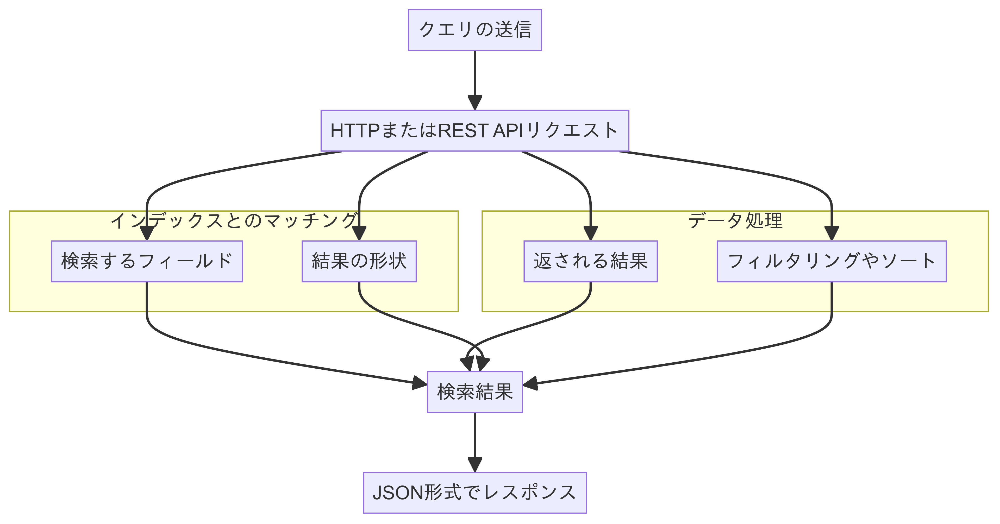

# Azure AI Document Intelligence

<!-- footer: 参考文献：[Microsoft Certified: Azure AI Fundamentals](https://learn.microsoft.com/ja-jp/credentials/certifications/azure-ai-fundamentals/?practice-assessment-type=certification#certification-prepare-for-the-exam) -->

---
<!-- header: Azure AI Document Intelligence -->
# Azure AI Document Intelligence の沿革

Microsoft が提供するドキュメント処理に関するサービスの名称で、以前は「Azure Form Recognizer」として知られていましたが、現在は「Azure AI Document Intelligence」としてブランド変更されました。これにより、ドキュメントのスキャン、解析、情報抽出などの機能を提供するサービスを指します。

    Azure Form Recognizer
    ↓
    Azure AI Document Intelligence（2023年7月以降）

---

<!-- header: Azure AI Document Intelligence -->
# Azure AI Document Intelligence の概要

Azure AI Document Intelligence (以降：Document intelligence) は、テキストの処理や情報の理解をサポートするAIの機能を指します。これは光学文字認識（OCR）の拡張で、これによって書類を読み取った後の次のステップを自動化します。例えば、大量の領収書を処理し、データベースに手動で入力する必要がある場合では、手作業は遅くミスが発生しやすいです。Document intelligenceを使うと、スキャンした領収書の画像をOCRでデジタル化し、データベースのフィールドに対応する項目名と紐付けできます。具体的なデータとして、店舗名、住所、合計金額、税額などを識別できます。Azure AI Document Intelligenceは、事前構築モデルに加え、カスタムモデルを用いたドキュメントやフォームの分析機能をサポートします。

---


---
<!-- header: Azure AI Document Intelligence -->
# Document Intelligence が提供する情報

機械学習モデルはバウンディングボックスの座標とテキストパターンを認識するように訓練されているため、文書や形式データを解釈できます。しかし、文書の形式が様々であるため、分析の自動化には課題があります。例えば、納税申告書と運転免許証にはどちらも名前が含まれますが、名前の位置は異なります。そのため、異なる形式に対して高品質な結果を得るために、個別の機械学習モデルを訓練する必要があります。一般的なドキュメント形式に対応する事前構築モデルを使うこともあれば、独自の形式に対応するためにモデルをカスタマイズすることもあります。テキスト読み取りとデータ記録の自動化により、業務を効率化し、顧客体験と意思決定を向上させることができます。次に、Azure AIサービスを使ってDocument Intelligenceを実装する方法を探ります。

## Key-value pair Label
**"key"** の例「住所」
**"value"** の例「123 Main Street」


---
<!-- header: Azure AI Document Intelligence -->

> 復讐しよう！
# モデルの学習サイクル
機械学習では、基礎モデルを選択し、トレーニングでそれを育成し、評価を行います。このサイクルを繰り返すことによって、最終的にいい結果を提供してくれるモデルを選択するのです。


---
# Document Intelligence のモデルについて
## Prebuilt models

    用途: 一般的な文書タイプ（請求書、名刺、IDドキュメントなど）を迅速かつ正確に処理するために使用されます。
    特徴: 事前に訓練されており、特定の文書タイプに特化したフィールド（例：請求書の合計金額、名刺の連絡先情報など）を認識し抽出するように設計されています。
    利点: 即時に使用可能で、一般的な文書処理タスクに対して高精度の結果を提供します。

## Custom models

    用途: 既存の事前訓練モデルでは対応できない特定のフィールドを識別するために使用されます。
    特徴: ユーザーが独自のデータセットを使用してモデルを訓練し、カスタマイズされたフィールドを抽出します。特殊な文書形式や業界固有の文書に対応できます。
    利点: 特定のニーズに応じた柔軟なモデルを構築でき、独自のフィールドやレイアウトに対応可能です。

## Document analysis

	用途: 一般的な文書のレイアウトや構造を理解し、関心領域とそれらの相互関係を解析するために使用されます。
	特徴: 文書全体の構造化データ表現を返し、関心領域（テキストブロック、テーブル、画像など）やそれらの相互関係を解析します。文書内のデータの位置関係やレイアウトを理解するために使用されます。
	利点: 複雑な文書の全体像を把握しやすくし、データの整理や相互関係の解析を支援します。

---
<!-- header: "" -->
# Azure AI Search
---
<!-- header: Azure AI Search -->

# Azure AI Search の概要
検索ソリューションを実現するためのインフラストラクチャーや、それを作成するためのツールが提供されています。構造化されたデータでもそうでなくても、あらゆる種類のデータの抽出が可能です。

これらはクラウドコンピューティング（PaaS）によって、その解析結果のみがユーザーのコンピューターに返されるので、ユーザーは高度なコンピュータの管理を行う必要がありません。


<!-- Azure AI Search（現在の名称は Azure Cognitive Search）は自立したツールではなく、ライブラリおよびサービスです。つまり、検索機能を実装するために開発者による設定やカスタマイズが必要です。以下のポイントで詳細を説明します：

1. ライブラリおよびサービス

•検索エンジンとしての役割: Azure Cognitive Searchは、検索エンジンとして機能し、データのインデックス作成や検索クエリの処理を行います。しかし、単体で検索のフロントエンドを提供するわけではなく、検索機能を提供するための基盤となるサービスです。
•開発者向けのツール: 検索機能を自分のアプリケーションやサービスに組み込むためには、Azure Cognitive SearchのAPIやSDKを利用して、検索機能を開発し、設定する必要があります。

2. カスタマイズと設定

•インデックス作成: データを検索可能にするためには、まずインデックスを作成し、データをインデックスに登録する必要があります。このプロセスは、データ構造や検索要件に応じてカスタマイズできます。
•クエリの設定: 検索クエリの構築や、検索結果のフィルタリング、並べ替えなどの設定を行うことができます。

3. 統合と拡張

•APIおよびSDKの利用: Azure Cognitive SearchはAPIを提供しており、これを使ってアプリケーションに検索機能を組み込むことができます。また、SDKを利用してより簡単に統合することも可能です。
•他のAzureサービスとの統合: Azureの他のサービス（例えば、Azure AI、Azure Machine Learningなど）と統合して、より高度な検索機能やAIによる強化を行うことができます。

4. 使い方

•カスタム開発: 開発者は、Azure Cognitive Searchの提供する機能を利用して、自分のニーズに合わせたカスタム検索ソリューションを作成する必要があります。
•設定と運用: 検索機能を運用するためには、検索のパフォーマンスチューニングやセキュリティ設定も考慮する必要があります。

まとめ

Azure Cognitive Searchは強力な検索エンジン機能を提供するサービスですが、それを有効に活用するためには、開発者がインデックスの設定や検索クエリの設計などを行う必要があります。自立したツールというよりは、カスタム検索機能を構築するためのプラットフォームです。 -->

---
> 用語解説
# インフラストラクチャー
1. データストレージ
•	Azure AI Searchは、データを格納し、検索インデックスを構築するためのストレージ機能を提供します。これには、Azure Blob StorageやAzure Cosmos DBなどが含まれます。
2. 検索エンジン：
•	インデックス作成とクエリ処理を行う検索エンジンの機能。これにより、テキストデータのインデックス化、検索クエリの解析、関連する検索結果の提供が可能になります。
3. スケーラビリティとパフォーマンス：
•	大量のデータや高頻度のクエリに対しても高いパフォーマンスを維持するためのスケーラビリティ。Azure AI Searchは、負荷分散や自動スケーリング機能を備えています。
4. セキュリティと認証：
•	データの保護とアクセス制御を行うためのセキュリティ機能。これには、Azure Active Directoryを利用した認証や、データ暗号化、役割ベースのアクセス制御（RBAC）が含まれます。
5. 開発者ツールとAPI：
•	検索ソリューションを開発・実装するためのツールやAPI。これには、Azure Portalでの管理ツール、RESTful API、SDK（ソフトウェア開発キット）が含まれます。
6. AIおよび機械学習機能：
•	エンティティ抽出、キーフレーズ抽出、言語理解などのAI機能を活用した高度な検索機能。これにより、ユーザーのクエリに対してより関連性の高い検索結果を提供できます。

---
# Azure AI Search の可用性 (Availability)

Azure AI Searchは既存の技術を補完するために存在し、オープンソースのソフトウェアライブラリであるApache Luceneの上に構築されたプログラム可能な検索エンジンを提供します。クラウドおよびオンプレミスに対して99.9%の稼働時間を保証するサービスレベルアグリーメント（SLA）を提供する、高可用性のプラットフォームです。

## 様々な機能の紹介

- **データの取り扱い**: JSON形式で提供される任意のデータソースを受け入れ、Azureの選定データソースに対しては自動クロール機能をサポートしています。
- **検索と分析の多様なオプション**: ベクトル検索、フルテキスト検索、ハイブリッド検索など、複数の検索および分析オプションを提供します。
- **AIによる強化**: 生のコンテンツから画像とテキストの分析を行うAzure AI機能が組み込まれています。
- **言語分析**: 56言語に対応した分析を提供し、音声マッチングや言語特有の言語学的処理を賢く扱います。Azure AI Searchで利用される自然言語処理技術は、BingやOfficeでも使用されています。
- **ユーザー体験のカスタマイズ**: ベクトルクエリ、テキスト検索、ハイブリッドクエリ、ファジー検索、オートコンプリート、物理的な位置に基づく地理検索フィルタリングなど、クエリ構文のオプションを提供します。
- **Azureのスケール、セキュリティ、統合**: データ層、機械学習層、Azure AIサービスおよびAzure OpenAIとの統合に対応しています。

<!-- •高可用性のプラットフォーム: システムやサービスが高い確率で利用可能であることを意味します。システム障害やダウンタイムが非常に少ないことを指します。
•クラウドおよびオンプレミス資産: クラウドはインターネット経由で提供されるサービスやリソースを指し、オンプレミス資産は企業が自社内で運用するサーバーやデータベースなどのリソースを指します。
•99.9%の稼働時間を保証する: サービスが一年間のうちの99.9%の時間（約8時間45分未満のダウンタイム）で稼働することを保証するということです。
•サービスレベルアグリーメント（SLA）: サービス提供者が顧客に対してサービスの可用性や性能に関する具体的な約束を定めた契約です。SLAには、保証される稼働時間やサポートの対応時間などが含まれます。 -->

<!-- Azure Cognitive Searchは、次のような特徴を持つことを意味します：

	1.	柔軟なデータ取り込み: JSON形式で提供される限り、どのようなデータソースからのデータも受け入れることができる。
	2.	自動データ収集: Azureの特定のデータソースに対しては、データを自動的にクロールして収集する機能を持っているため、データの同期や更新が容易になる。

この機能により、開発者や運用者は、さまざまなデータソースから効率的にデータを取り込み、強力な検索機能を構築することが可能になります。 -->

---
>用語解説
# Apache Lucene
Apache Luceneは、全文検索やテキスト検索を行うためのオープンソースのソフトウェアライブラリです。Javaで書かれており、高速でスケーラブルな検索エンジンを構築するための機能を提供します。例えば、Amazon、Twitter、図書館書籍管理、法務文書管理などのソリューションで利用されています。以下は、Apache Luceneの主な特徴です：
1. **全文検索機能**：複雑なクエリを実行し、テキストの全文検索を効率的に行うことができます。キーワード検索、フレーズ検索、ファジー検索など、多様な検索オプションをサポートします。
2. **インデックス作成**：大量のテキストデータをインデックス化し、検索を高速化します。インデックス作成プロセスにより、ドキュメントを効率的に検索することが可能です。
3. **スケーラビリティ**：大規模なデータセットに対しても高いパフォーマンスを発揮します。分散検索やシャーディングなどの手法を用いて、スケールアウトが可能です。
4. **オープンソース**：Apache Software Foundationによって管理されており、オープンソースライセンス（Apache License 2.0）で提供されています。誰でも自由に利用、修正、配布が可能です。
5. **カスタマイズ可能**：豊富なプラグインや拡張機能を用いて、自分のニーズに合わせた検索エンジンを構築することができます。
6. **多言語サポート**：英語だけでなく、他の多くの言語のテキストもサポートしています。各言語に特化したアナライザーを使用することで、言語特有の検索を行うことができます。

---
<!-- header: Azure AI Search -->

# Search Solution、処理手順の確認
1. **Data sourceから開始**：PDF, video files, images などのすでに所有のファイルを含めることができます。
2. **Indexer** : データソースから自動でデータを取り出し、解析や強化を行い、インデックス化します。インデクサーはデータの取り込み過程を一部自動化し、形式をJSONに変換します。（in an action called JSON serialization）
3. **Document craking**：ファイルを開き、コンテンツを抽出。
4. **Enrichament**：様々なスキルの組み合わせで、コンテンツは強化されます。強化のスキルとしては翻訳やOCRなどが例として挙げられ、それらにより写真にキャプションが追加されたり、テキストに感情ラベルが追加されたりします。強化されたコンテンツはAzure Storageに送信されてBlobやテーブルに保持され、後続の処理に利用可能です。
5. **Push to index**：クエリを通じて、検索インデックが生成されます。これはテーブルに似た構造を持ち「index schema」と呼びます。これにはフィールド、型（such as string）、およびフィールドの属性を含みます。この属性により、フィルタリングやソートが可能になります。


---
# Azure portal
Azure portalでコンポーネントを管理することができます。これはプロビジョニングが完了すると使用することできます。

下記のオプションを使用することができます。
- Azure portal's Import data wizard
- REST API
- software development kit (SDK)


<!-- これらは、Azureの検索ソリューションやその他のクラウドサービスを操作・管理するための異なるアプローチやツールです。

### Azure portal's Import data wizard
- **機能**: Azureポータルに用意されているユーザーインターフェースで、データをインポートして検索インデックスを作成するためのウィザード（手順案内ツール）です。主にGUIを通じて簡単に設定や操作が行えます。
- **特徴**: コーディングが不要で、直感的に操作できるため、技術的な知識があまりなくても使用可能です。インポートするデータのソースを選択し、インデックスの設定を行う際に便利です。

### REST API
- **機能**: Representational State Transfer (REST) APIは、AzureのリソースやサービスをHTTPリクエストを通じて操作するためのインターフェースです。プログラムから直接Azureのサービスを操作・管理できます。
- **特徴**: プログラムやスクリプトを通じてAzureのサービスにアクセスできるため、カスタムアプリケーションや自動化されたワークフローの中でAzureの機能を利用したい場合に便利です。操作に関して柔軟性が高く、コマンドラインやプログラムから利用されます。

### Software Development Kit (SDK)
- **機能**: SDKは、特定のプログラミング言語向けに提供されるライブラリやツールのセットで、Azureサービスをその言語内で簡単に操作するためのものです。例えば、C#, Python, Javaなどの言語向けに提供されています。
- **特徴**: SDKを使用することで、Azureの機能をプログラム内に直接統合し、開発作業を効率化できます。特定の言語で利用する際に最適化されたAPIやヘルパーツールが含まれているため、開発者がコードを書いてAzureのリソースを操作する際に非常に便利です。

### 使い分け
- **Import data wizard**: コーディング不要で、インターフェースを使って設定を行いたいとき。
- **REST API**: コードやスクリプトから直接操作したいときや、柔軟な管理・操作をしたいとき。
- **SDK**: プログラミング言語を使って開発しながらAzureのサービスを統合・操作したいとき。

これらのツールを使い分けることで、Azureのサービスを自分のニーズに合った方法で利用できます。 -->
---
# Import data wizard を使用する
検索エンジンに必要な様々なオブジェクトを作成するためのプロセスを自動化します。ここで言う「オブジェクト」とは、Azure AI Search サービス内で作成・管理する構成要素やエンティティを指します。具体的には以下のようなものがあります。

- データソース: 検索インデックスのデータを取得するための接続情報を保持するオブジェクト。
- インデックス: 検索クエリやフルテキスト検索を実行するためにデータを構造化する物理的なデータ構造。
- インデクサー: データソースからインデックスへのデータ転送を管理する構成オブジェクト。
- スキルセット: データを加工、変換、分析するための指示セットで、情報抽出や内容の強化を行う。
- ナレッジストア: AIによるデータ処理の結果を保存し、後で利用するためのストレージ。
---
# Azure AI Search Index でのクエリ
インデックスとクエリの設計は密接に関連しています。インデックスを構築した後、クエリを実行することができます。重要なのは、インデックスのスキーマがどのクエリに対応できるかを決定する点です。

Azure AI Search では、クエリはHTTPまたはREST APIリクエストとして送信され、レスポンスはJSON形式で返されます。クエリでは、検索するフィールドや返される結果、結果の形状、フィルタリングやソートの方法を指定できます。フィールドを指定しないクエリは、インデックス内のすべての検索可能なフィールドに対して実行されます。



---
## ２つの構文
Azure AI Search は、simpleとfull Lucene の二つの構文をサポートしています。simpleは一般的なクエリシナリオに対応し、full Lucene構文は高度なシナリオに役立ちます。

# Simple クエリリクエスト (内部処理)

クエリリクエストは下記のような例に見られるように、検索用語とクエリ演算子で構成されます。

```js
coffee (-"busy" + "wifi")
```

演算子に割り当てられたフレーズは、厳密に一致されたものが除外、または含まれる結果になります。例えば「wifi」は対象となりますが「wi-fi」はい対象になりません。simpleはfull Luceneのクエリ構文の複雑な機能の一部を除外しており、デフォルトの検索構文として使用されています。

---
# Summary
このモジュールでは、Azure AI Search を探求しました。これは、スケーラブルで豊かな検索体験を提供するためのインフラとツールを提供する、Microsoft のプラットフォームサービス（PaaS）ソリューションです。このモジュールでは、Azure AI Search のインデクシングパイプラインがどのように非構造化データを取り込み、情報を JSON 形式でシリアライズし、AI 強化を行い、データを検索インデックスに持ってくるかの概要が説明されました。

他のポイントとしては、インデックスとクエリ設計の関係を理解し、インデックススキーマが可能なクエリを決定すること、Azure ポータルの Import data wizard を使用してインデクシングを自動化できることが挙げられます。このモジュールを読むことで、Azure AI Search がどのようにあらゆる種類のメディアからのインサイトの検索を効率化するかを理解できるようになります。